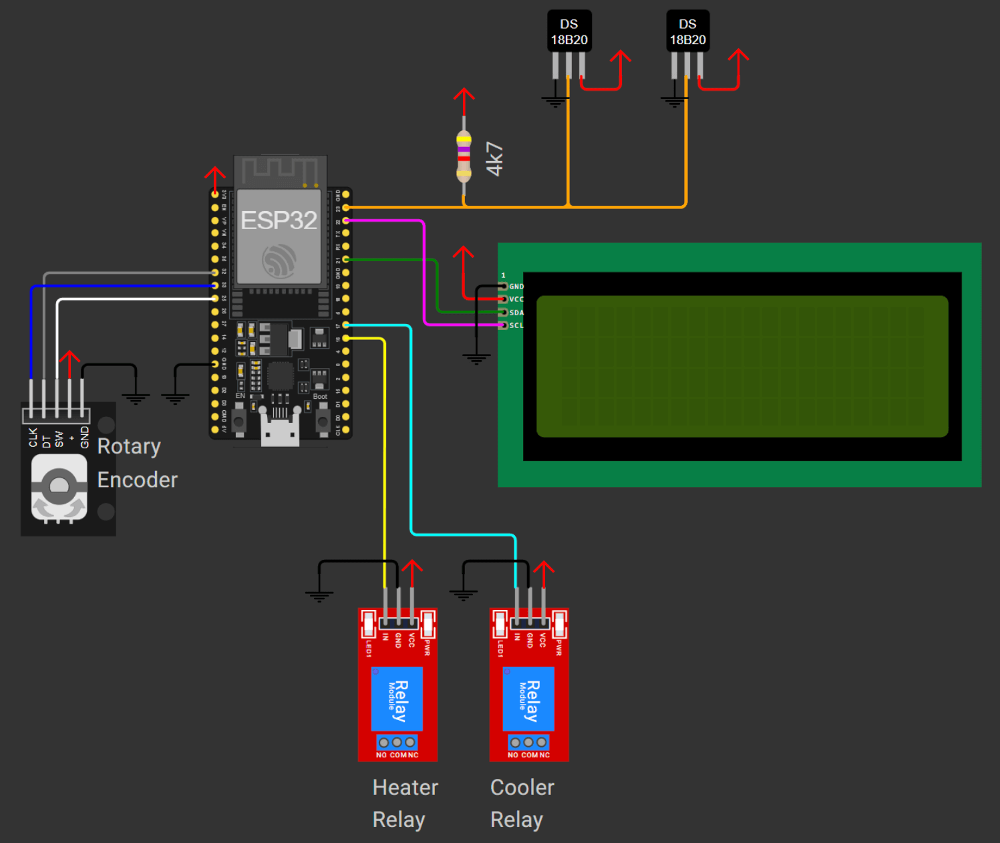

# Fridgin Awesome

A fermentation chamber controller for beer brewing implemented using ESPHome. This project aims to replicate the sophisticated temperature control logic from the BrewPi project, with native Home Assistant integration. By using the ESPHome framework, the source code aims to be vastly more accessable to the novice DIYer and can be easily modified to suit your specific needs.

### Inspiration

This project is heavily inspired by and based on the control algorithms from the original [BrewPi](https://github.com/BrewPi) project. A shoutout also to [BrewPiLess](https://github.com/vitotai/BrewPiLess) which provides an ESP8266 / ESP32 based implementation without the Raspberry Pi.

### Features

- Sophisticated temperature control logic using a state machine
- Adaptive overshoot prediction for minimal temperature fluctuations
- PID controller for beer temperature management
- Different control modes:
  - **Beer Mode**: Regulates beer temperature (using PID to control fridge temperature)
  - **Fridge Mode**: Directly regulates fridge/chamber temperature
  - **Profile Mode**: For pre-defined temperature profiles.
- Peak detection algorithms to learn the thermal characteristics of your fermentation chamber

This project is designed to integrate with Home Assistant. There is no built in web interface on the device.

## Hardware Requirements

- ESP32 development board
- Two DS18B20 temperature sensors:
  - One for beer temperature
  - One for fridge/chamber temperature
- Relay-controlled heating element
- Relay-controlled cooling element (refrigerator/freezer)
- 20x4 I2C LCD character display (optional)
- Rotary encoder with pushbutton for interface (optional)



Note: This project is hardware compatible with [BrewPiLess](https://github.com/vitotai/BrewPiLess).

## ESPHOME Installation
When installing via the [ESPHome addon](https://esphome.io/guides/getting_started_hassio.html) in Home Assistant, simply add your new device via the dashboard and then add the following to your esphome yaml configuration and run the install.
```
packages:
  remote_package: 
    url: https://github.com/sryburn/fridgin-awesome/
    file: fridgin-a.yaml

substitutions:
  # Update these with your actual addresses
  fridge_temp_address: '0x31031687b04aff28'
  beer_temp_address: '0xd103168221c1ff28'    
```
Your 1-wire addresses can be obtained from the device logs after the installation and updated accordingly. Note that all definitions contained in system_config.yaml (and elsewhere) can be overidden in your device yaml file, see https://esphome.io/components/packages.html. 

When installing via the [ESPHome CLI](https://esphome.io/guides/installing_esphome.html), simply clone the repo, edit device_config.yaml as required, add your secrets .yaml file and/or edit base_config.yaml as required.
Run `esphome run fridgin-a.yaml` (as per https://esphome.io/guides/cli.html#run-command) to compile and upload to your device.

## Home Assistant Dashboard Setup

This section will walk you through setting up a Home Assistant dashboard for the Fridgin' Awesome fermentation controller. The dashboard provides a user-friendly interface for monitoring and controlling your fermentation process, including creating and managing beer fermentation profiles. This dashboard is designed to get you up and running quickly using the built in Home assistant dashboard components.

### 1. Update the configuration files with your ESPHome device name

1. Copy the two files from the `ha-dashboard` directory.
2. Open the `fridgin_a_configuration.yaml` and `dashboard.yaml` files in a text editor.
3. Replace all occurances of the placeholder `${DEVICE}` with your actual ESPHome device name.
4. Save the files.

Note: Alternatively this can also be done on the command line for those so inclined:

Linux / MacOS:
```bash
sed -i.bak 's/\${DEVICE}/your_device_name/g' fridgin_a_configuration.yaml dashboard.yaml
```
Windows Powershell:
```powershell
$device='your_device_name'; 'fridgin_a_configuration.yaml','dashboard.yaml' | ForEach-Object { 
  (Get-Content $_) -replace '\$\{DEVICE\}',$device | Set-Content $_ 
}
```

### 2. Initial Configuration

1. Copy the `fridgin_a_configuration.yaml` file to your Home Assistant /config directory.

2. Add the following to your `configuration.yaml` file to include the configuration:

```yaml
homeassistant:
  packages:
    fridgin_awesome: !include fridgin_a_configuration.yaml
```

3. Restart Home Assistant to load the configuration.

### 2. Setting Up the Variables Sensor

The Fridgin' Awesome system uses a special "variables sensor" to store persistent data, including your beer profiles. This sensor needs to be initialized before first use:

1. Go to **Developer Tools** > **Services** in your Home Assistant UI.

2. Select the `script.initialize_beer_profiles` service and call it. This will:
   - Create the initial storage structure in the variables sensor
   - Allow you to start saving and loading beer profiles

### 3. Adding the Dashboard

1. Go to **Settings** > **Dashboards** in your Home Assistant UI.

2. Click the "+" button to add a new dashboard.

3. Choose "New dashboard from scratch" and click "Save" to create the dashboard.

4. Access the dashboard and click the pencil icon to edit and then select 'Raw configuration editor' under the three dots menu.

5. Copy and paste the contents of the `dashboard.yaml` file into the raw configuration editor and click "Done" to save the dashboard.

## Using the Dashboard

The dashboard consists of three main tabs:

### Fermentation Tab

This tab shows the current state of your fermentation controller:

- Current beer and fridge temperatures
- Operating mode (Beer, Fridge, or Profile)
- Current setpoints
- Temperature history graph

### Beer Profile Tab

This tab allows you to create, save, load, and apply beer fermentation profiles:

- Visual profile timeline chart showing temperature steps over time
- Profile management controls (save, delete, apply)
- Up to 10 customizable fermentation steps with:
  - Step type (hold or ramp)
  - Temperature setpoint
  - Duration
- Calculated start and end times for each step

### Advanced Tab

This tab provides detailed information about the controller's operation:

- PID controller details
- Learning system information
- System information (WiFi signal, IP address)

## Working with Beer Profiles

### Creating a Beer Profile

1. Go to the "Beer Profile" tab.
2. Make sure "New Profile" is selected in the "Profile Selection" dropdown.
3. Enter a name for your profile.
4. Set the start time (or click "Set to Now").
5. Configure the temperature and duration for each step.
6. Use "Add Step" or "Remove Step" to adjust the number of steps.
7. Click "Save Profile" to store your profile in the variables sensor.
8. A Profile timeline chart will update to visualise your profile.

### Loading a Saved Profile

1. Select a profile from the "Profile Selection" dropdown.
2. The profile configuration will be loaded into the interface.
3. You can modify the profile if needed and save it again.

### Applying a Profile to Your Controller

1. Configure your profile (either create a new one or load an existing one).
2. Click "Apply Profile" to send the profile to your fermentation controller.

> **Note** Remember to save your profile first, before applying it.

### Running the Test Profile

For testing purposes, you can run a quick 18-minute test profile:

1. Go to **Developer Tools** > **Services**.
2. Select `script.apply_test_profile`.
3. Call the service to apply a test profile with three 6-minute steps.

This is useful for verifying that your controller is correctly following temperature profiles without waiting for full-length fermentation steps.

## Troubleshooting

### Inspecting the Variables Sensor

If you're having issues with beer profiles not saving or loading correctly, you can inspect the variables sensor:

1. Go to **Developer Tools** > **States**.
2. Search for `sensor.variables`.
3. Examine the attributes, particularly the `variables` attribute which contains the stored data.

The `variables` attribute should have a `beer_profiles` object containing all your saved profiles.

### How the Beer Profile System Works

1. Profiles are created and configured via the UI inputs.
2. When saved, the profile is serialized to JSON and stored in the variables sensor.
3. When applied, the profile is converted to the ESPHome-specific format and sent to the device. One applied the profile is run locally on the esphome device.
4. The ESPHome device then automatically adjusts the beer temperature according to the profile schedule.

The system supports two types of temperature steps:
- **Hold**: Maintains a constant temperature for the specified duration
- **Ramp**: Gradually changes temperature from the previous step's value to the target over the specified duration.

> **Note** It is not necessesary to specify a ramp step between hold steps if you want to change the setpoint immediately